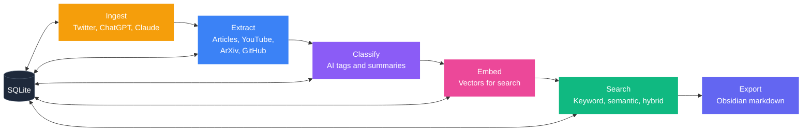
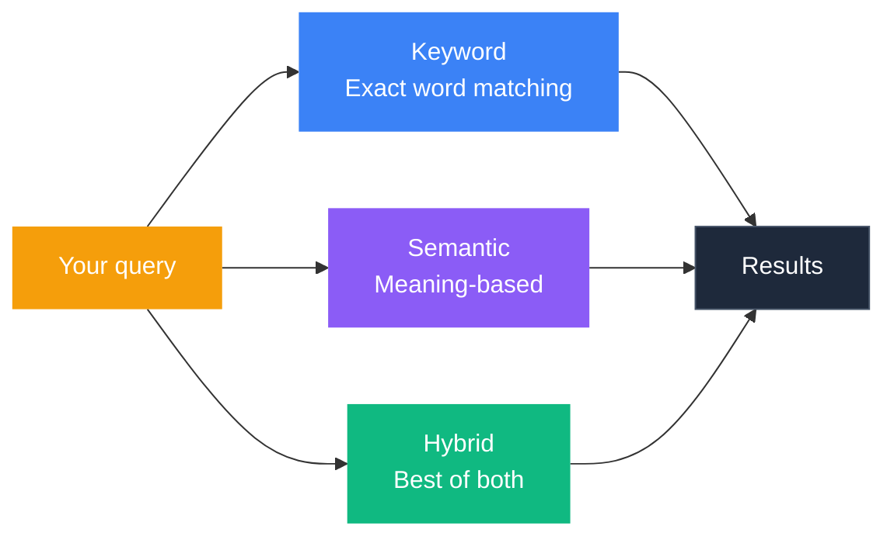

<p align="center">
  <picture>
    <source media="(prefers-color-scheme: dark)" srcset="assets/banner-dark.png" />
    <source media="(prefers-color-scheme: light)" srcset="assets/banner-light.png" />
    
  </picture>
</p>

<p align="center">
  
  
  
</p>

<p align="center">
  <strong>Turn your Twitter bookmarks and AI conversations into a searchable knowledge base.</strong>
</p>

> **Alpha software.** Rough edges, limited sources, and no tests yet. Built for personal use, now open for anyone who wants to try it or contribute.

<p align="center">
  <a href="#quickstart">Quickstart</a> &bull;
  <a href="#what-it-does">What It Does</a> &bull;
  <a href="#search">Search</a> &bull;
  <a href="#all-commands">Commands</a> &bull;
  <a href="docs/Home.md">Docs</a>
</p>

---

## The Problem

You bookmark tweets. You save ChatGPT conversations. You never find any of it again.

IdeaBank pulls your bookmarks and chat exports into a single local SQLite database, then lets you search across all of it by keyword or by meaning.

---

## What It Does Today

You can **ingest** from two sources:

<p align="center">
  
  &nbsp;
  
</p>

Once your content is ingested, IdeaBank can **extract full text** from URLs found inside your tweets and conversations:

<p align="center">
  
  &nbsp;
  
  &nbsp;
  
  &nbsp;
  
</p>

And optionally **export** to:

<p align="center">
  
</p>

| What | How | Needs API key? |
|:-----|:----|:---------------|
| Import Twitter bookmarks | `ib ingest twitter bookmarks.json` | No |
| Import ChatGPT/Claude chats | `ib ingest conversation export.json` | No |
| Extract article text from URLs in your items | `ib extract` | No |
| Keyword search across everything | `ib search "query"` | No |
| AI-powered tagging and summaries | `ib classify` | Yes (OpenAI) |
| Semantic search by meaning | `ib semantic "query"` | Yes (OpenAI) |
| Combined keyword + semantic search | `ib hybrid "query"` | Yes (OpenAI) |
| Export to Obsidian markdown | `ib export` | No |

---

## Quickstart

```bash
# Clone and install
git clone https://github.com/ZealousEar/ideabank.git
cd ideabank
pip install -e .

# Set up
ib init

# Import your Twitter bookmarks (X's native JSON export format)
ib ingest twitter bookmarks.json

# Pull full text from article links found in your tweets
ib extract

# Search by keyword (works immediately, no API key)
ib search "transformer attention"
```

To unlock AI features (tagging, summaries, semantic search):

```bash
export OPENAI_API_KEY=sk-...

ib classify --dry-run        # see cost estimate first (~$0.01/100 items)
ib classify                  # run it

ib embed                     # generate vectors (~$0.002/100 items)
ib semantic "papers about reasoning"
```

---

## How It Works



Stages 1, 2, 5 (keyword), and 6 work without an API key. Stages 3, 4, and 5 (semantic/hybrid) need an OpenAI key.

<details>
<summary><strong>Technical details per stage</strong></summary>

| Stage | What it does | Tech |
|:------|:-------------|:-----|
| **Ingest** | Parses Twitter bookmark exports and AI conversation logs into normalized items | JSON parsing, SHA256 dedup |
| **Extract** | Fetches full text from URLs found in your ingested items, routing to specialized extractors | httpx, trafilatura, ArXiv Atom API, YouTube transcript API |
| **Classify** | Labels each item with domain, content type, summary, and tags | GPT-4.1-mini with heuristic fallback |
| **Embed** | Creates 1536-dim vector representations for semantic similarity | text-embedding-3-small |
| **Search** | Keyword (FTS5/BM25), semantic (cosine similarity), or hybrid (Reciprocal Rank Fusion) | SQLite FTS5, numpy |
| **Export** | Renders items as Obsidian-compatible Markdown with YAML frontmatter | Template-based rendering |

</details>

---

## Search



**Keyword** matches exact words. Works immediately after ingestion, no API key needed.
```bash
ib search "attention mechanism"
```

**Semantic** matches by *meaning*. Requires running `ib embed` first (needs OpenAI key).
```bash
ib semantic "how do LLMs reason"
```

**Hybrid** runs both and merges results. Best accuracy, but requires embeddings.
```bash
ib hybrid "reinforcement learning from human feedback"
```

---

## All Commands

```
Pipeline:
  ib init                       Set up database and directories
  ib ingest twitter FILE        Import Twitter bookmarks
  ib ingest conversation FILE   Import ChatGPT/Claude conversations
  ib check SOURCE               Auto-detect and import new files from raw/
  ib extract                    Fetch full text from URLs in your items
  ib classify                   AI tagging and summarization (needs API key)
  ib embed                      Generate vectors for semantic search (needs API key)
  ib export                     Render to Obsidian Markdown

Search:
  ib search QUERY               Keyword search (no API key)
  ib semantic QUERY             Meaning-based search (needs embeddings)
  ib hybrid QUERY               Combined search (needs embeddings)

Management:
  ib stats                      See what's in your knowledge base
  ib inbox                      Items you haven't reviewed yet
  ib stage ITEM_ID STAGE        Move items through your workflow
  ib tag ITEM_ID TAG            Add tags to any item
  ib categorize                 Auto-sort items into topics
```

> `ib classify` and `ib embed` support `--dry-run` to preview cost before spending.

---

## Limitations

Things to know before you start:

- **Two ingest sources only.** Twitter bookmarks (X's native JSON format) and ChatGPT/Claude conversation exports. No Chrome bookmarks, Reddit, RSS, or direct URL input yet.
- **Extraction is not standalone.** `ib extract` pulls content from URLs found *inside* your ingested items. You can't feed it a URL directly.
- **YouTube extraction needs captions.** Videos without transcripts will fail silently.
- **GitHub API is unauthenticated.** Rate-limited to 60 requests/hour.
- **No sample data included.** You need your own Twitter export or conversation file to try it.
- **No tests.** This was a personal tool first. Test suite is planned.

---

## Configuration

IdeaBank stores everything under `~/.ideabank/`:

```
~/.ideabank/
├── config.yaml          # Settings (auto-created on first run)
├── db/ideabank.db       # Your knowledge base
├── raw/                 # Drop files here for ingestion
│   ├── twitter/
│   ├── conversations/
│   └── youtube/
└── cache/               # Extraction cache
```

<details>
<summary>Example config</summary>

```yaml
db_path: ~/.ideabank/db/ideabank.db
vault_path: ~/my-obsidian-vault
extraction:
  concurrency: 5
  timeout_seconds: 20
classification:
  model: gpt-4.1-mini
embedding:
  model: text-embedding-3-small
  dimensions: 1536
```

</details>

---

<details>
<summary><strong>Project structure</strong></summary>

```
ideabank/
├── pyproject.toml              # Package config, dependencies, entry points
├── src/ideabank/
│   ├── core/                   # Database, models, config, repository pattern
│   ├── ingestors/              # Twitter bookmarks + conversation parsers
│   ├── extraction/             # URL content fetchers (article, ArXiv, GitHub, YouTube)
│   ├── classification/         # LLM labeling with taxonomy + fallback heuristics
│   ├── embeddings/             # Vector generation, storage, and similarity search
│   ├── search/                 # FTS5 full-text search
│   ├── processing/             # Pattern-based categorization
│   ├── export/                 # Obsidian Markdown renderer
│   └── cli/                    # Typer CLI (16 commands)
├── docs/                       # Architecture, schema, search, CLI, extractor docs
└── tests/                      # (planned)
```

</details>

<details>
<summary><strong>Tech stack</strong></summary>

| Layer | Technology | Why |
|:------|:-----------|:----|
| **Database** | SQLite + WAL mode + FTS5 | Single-file, zero-config, full-text search built in |
| **Models** | Pydantic v2 | Validation, serialization, type safety |
| **Async** | aiosqlite + httpx | Non-blocking I/O for batch extraction and embedding |
| **Classification** | OpenAI GPT-4.1-mini | Low cost, fast, effective for tagging |
| **Embeddings** | text-embedding-3-small (1536d) | Best price-to-quality ratio at personal scale |
| **Vector search** | sqlite-vec (optional) | Native SQLite extension; falls back to JSON + numpy |
| **Extraction** | trafilatura | Best Python library for article text extraction |
| **CLI** | Typer + Rich | Type-driven argument parsing, pretty terminal output |
| **IDs** | ULID | Sortable by time, unique, URL-safe |

</details>

---

## FAQ

<details>
<summary><strong>Cost?</strong></summary>

Importing, extracting articles, and keyword search are free, no API calls. AI classification costs about **$0.01 per 100 items**. Embeddings cost about **$0.002 per 100 items**. Use `--dry-run` to see the estimate before spending.

</details>

<details>
<summary><strong>Do I need Obsidian?</strong></summary>

No. IdeaBank works as a standalone command-line tool. The Obsidian export is optional.

</details>

<details>
<summary><strong>Can I use a different AI model?</strong></summary>

Anything compatible with the OpenAI API works: Ollama (free, local), LiteLLM, Azure OpenAI. Set the `OPENAI_BASE_URL` environment variable to point at your provider.

</details>

<details>
<summary><strong>Is my data private?</strong></summary>

Yes. Everything stays on your computer in a local SQLite file. The only external calls go to the OpenAI API for classification and embedding, and only when you run those commands.

</details>

---

## Roadmap

- [ ] End-to-end Twitter bookmarks to knowledge base (one command)
- [ ] Test suite
- [ ] Reddit saved posts
- [ ] Chrome / Brave bookmark import
- [ ] Direct URL input (`ib add https://...`)
- [ ] Pocket & Readwise sync
- [ ] RSS feed monitoring
- [ ] Local AI models (no API key needed)
- [ ] Web UI for browsing and search
- [ ] Sample data for first-run experience

---

## License

MIT
