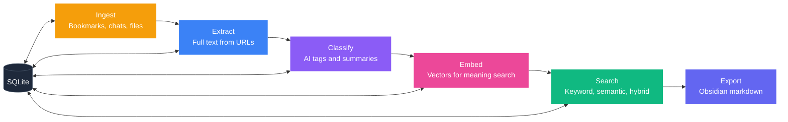
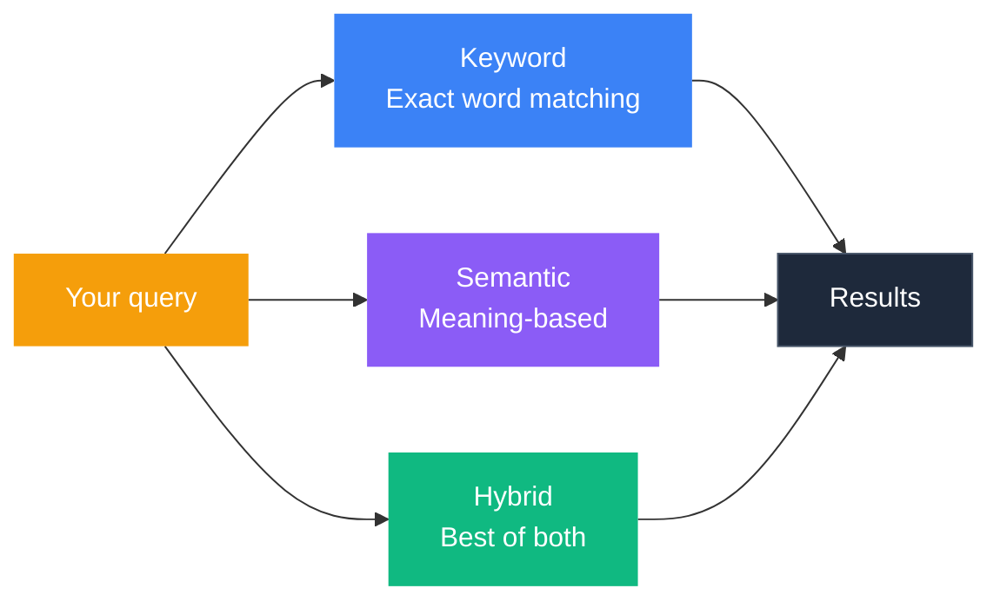

<p align="center">
  <picture>
    <source media="(prefers-color-scheme: dark)" srcset="assets/banner-dark.png" />
    <source media="(prefers-color-scheme: light)" srcset="assets/banner-light.png" />
    
  </picture>
</p>

<p align="center">
  
  
  
  
  
</p>

<p align="center">
  <strong>Turn scattered bookmarks, AI chats, and articles into a searchable knowledge base.</strong>
  <br />
  <em>One local database. AI enrichment. Search by meaning.</em>
</p>

> **Alpha software.** APIs will change and features are still landing. Feedback and contributions welcome.

<p align="center">
  <a href="#quickstart">Quickstart</a> &bull;
  <a href="#how-it-works">How It Works</a> &bull;
  <a href="#works-with">Sources</a> &bull;
  <a href="#search">Search</a> &bull;
  <a href="#all-commands">Commands</a> &bull;
  <a href="docs/Home.md">Docs</a>
</p>

---

## The Problem

You bookmark tweets. You save ChatGPT conversations. You star GitHub repos. You highlight articles. Then you never find any of it again.

IdeaBank pulls all of that into **one local database**, adds AI-generated summaries, tags, and embeddings, then lets you search across everything by keyword or by meaning.

Your data stays on your machine in a single SQLite file.

---

## Works With

<p align="center">
  <a href="#quickstart"></a>
  &nbsp;
  <a href="#quickstart"></a>
  &nbsp;
  <a href="#quickstart"></a>
  &nbsp;
  <a href="#quickstart"></a>
  &nbsp;
  <a href="#quickstart"></a>
  &nbsp;
  <a href="#quickstart"></a>
  &nbsp;
  <a href="#quickstart"></a>
</p>

<p align="center">
  <em>Export to</em>&nbsp;&nbsp;<a href="#quickstart"></a>
</p>

| Source | What you give it | What you get back |
|:-------|:-----------------|:------------------|
| **Twitter / X** | Your bookmarks JSON export | Every tweet, author, image, and linked article |
| **ChatGPT** | `conversations.json` from your data export | All your chats, organized by conversation, with model info |
| **Claude** | JSON export | Every message, with role attribution |
| **YouTube** | Links found in your bookmarks | Full video transcripts, searchable by content |
| **ArXiv** | Paper links found in your bookmarks | Titles, abstracts, and metadata |
| **GitHub** | Repo links found in your bookmarks | README content and repo metadata |
| **Any URL** | Article links found in your content | Cleaned full-text, stripped of ads and navigation |

<details>
<summary>Coming soon</summary>

- Reddit saved posts
- Chrome / Brave bookmarks
- Pocket & Readwise
- RSS feeds
- Notion exports

</details>

---

## Quickstart

```bash
# Install
git clone https://github.com/ZealousEar/ideabank.git
cd ideabank
pip install -e .

# Set up your knowledge base
ib init

# Import your Twitter bookmarks
ib ingest twitter bookmarks.json

# Pull in the full text behind every link
ib extract

# AI tagging and summarization (needs OPENAI_API_KEY)
ib classify --dry-run        # preview the cost first
ib classify                  # run it

# Generate vectors for meaning-based search
ib embed

# Find things
ib search "transformer attention"     # keyword search
ib semantic "papers about reasoning"  # meaning-based search
ib hybrid "LLM agents"               # combined search
```

> **Note:** Classification and embedding need an OpenAI API key (`export OPENAI_API_KEY=sk-...`). Importing, article extraction, and keyword search work without one.

---

## How It Works

Your content flows through six stages. Each one is optional. Run what you need, skip what you don't.



<details>
<summary><strong>Technical details per stage</strong></summary>

| Stage | What it does | Tech | Needs API key? |
|:------|:-------------|:-----|:---------------|
| **Ingest** | Parses Twitter bookmark exports and AI conversation logs into normalized items | JSON parsing, SHA256 dedup | No |
| **Extract** | Fetches full text behind URLs, routing to specialized extractors per domain | httpx, trafilatura, ArXiv API, YouTube transcript API | No |
| **Classify** | Labels each item with domain, content type, summary, and tags | GPT-4.1-mini with heuristic fallback | Yes |
| **Embed** | Creates 1536-dimensional vector representations for semantic similarity | text-embedding-3-small | Yes |
| **Search** | Keyword (FTS5/BM25), semantic (cosine similarity), or hybrid (Reciprocal Rank Fusion) | SQLite FTS5, numpy | Semantic/hybrid only |
| **Export** | Renders items as Obsidian-compatible Markdown with YAML frontmatter and wikilinks | Template-based rendering | No |

</details>

---

## Search



**Keyword** matches exact words. Fast and precise when you know what term you're looking for.
```bash
ib search "attention mechanism"
```

**Semantic** matches by *meaning*. Searching "how do LLMs reason" returns articles about chain-of-thought prompting, even if those articles don't contain the word "reason."
```bash
ib semantic "how do LLMs reason"
```

**Hybrid** runs both and merges the results. Recommended for most queries.
```bash
ib hybrid "reinforcement learning from human feedback"
```

<details>
<summary><strong>Hybrid search internals</strong></summary>

Hybrid runs keyword (FTS5/BM25) and semantic (cosine similarity) in parallel, then merges results using Reciprocal Rank Fusion (RRF). Items that rank high in *both* methods float to the top. Tune the balance with `--fts-weight` (default: 0.4 keyword, 0.6 semantic).

</details>

---

## All Commands

```
ib init                       Set up your knowledge base
ib ingest twitter FILE        Import Twitter bookmarks
ib ingest conversation FILE   Import ChatGPT/Claude conversations
ib check SOURCE               Auto-detect and import new files
ib extract                    Fetch full text from linked URLs
ib classify                   AI tagging and summarization
ib embed                      Generate vectors for semantic search
ib export                     Render to Obsidian Markdown

ib search QUERY               Keyword search
ib semantic QUERY             Meaning-based search
ib hybrid QUERY               Combined search (recommended)

ib stats                      See what's in your knowledge base
ib inbox                      Items you haven't reviewed yet
ib stage ITEM_ID STAGE        Move items through your workflow
ib tag ITEM_ID TAG            Add tags to any item
ib categorize                 Auto-sort items into topics
```

> Every command that calls an API supports `--dry-run` so you can preview the cost before spending anything.

---

## Project Structure

<details>
<summary>For contributors</summary>

```
ideabank/
├── pyproject.toml              # Package config, dependencies, entry points
├── src/ideabank/
│   ├── core/                   # Database, models, config, repository pattern
│   ├── ingestors/              # Source-specific parsers (Twitter, conversations)
│   ├── extraction/             # URL content fetchers (article, ArXiv, GitHub, YouTube)
│   ├── classification/         # LLM labeling with taxonomy + fallback heuristics
│   ├── embeddings/             # Vector generation, storage, and similarity search
│   ├── search/                 # FTS5 full-text search
│   ├── processing/             # Pattern-based categorization
│   ├── export/                 # Obsidian Markdown renderer
│   └── cli/                    # Typer CLI (16 commands)
├── docs/                       # Architecture, schema, search, CLI, extractor docs
└── tests/                      # (coming soon)
```

</details>

<details>
<summary>Tech stack</summary>

| Layer | Technology | Why |
|:------|:-----------|:----|
| **Database** | SQLite + WAL mode + FTS5 | Single-file, zero-config, full-text search built in |
| **Models** | Pydantic v2 | Validation, serialization, type safety |
| **Async** | aiosqlite + httpx | Non-blocking I/O for batch extraction and embedding |
| **Classification** | OpenAI GPT-4.1-mini | Low cost, fast, effective for tagging |
| **Embeddings** | text-embedding-3-small (1536d) | Best price-to-quality ratio at personal scale |
| **Vector search** | sqlite-vec (optional) | Native SQLite extension; falls back to JSON + numpy |
| **Extraction** | trafilatura | Best Python library for article text extraction |
| **CLI** | Typer + Rich | Type-driven argument parsing, pretty terminal output |
| **IDs** | ULID | Sortable by time, unique, URL-safe |

</details>

---

## Configuration

IdeaBank stores everything under `~/.ideabank/`:

```
~/.ideabank/
├── config.yaml          # Settings (auto-created on first run)
├── db/ideabank.db       # Your knowledge base
├── raw/                 # Drop files here for ingestion
│   ├── twitter/
│   ├── conversations/
│   └── youtube/
└── cache/               # Extraction cache
```

<details>
<summary>Example config</summary>

```yaml
db_path: ~/.ideabank/db/ideabank.db
vault_path: ~/my-obsidian-vault
extraction:
  concurrency: 5
  timeout_seconds: 20
classification:
  model: gpt-4.1-mini
embedding:
  model: text-embedding-3-small
  dimensions: 1536
```

</details>

---

## FAQ

<details>
<summary><strong>Cost?</strong></summary>

Importing, extracting articles, and keyword search are **free**, no API calls. AI classification costs about **$0.01 per 100 items**. Embeddings cost about **$0.002 per 100 items**. Use `--dry-run` on any command to see the estimate before spending.

</details>

<details>
<summary><strong>Do I need Obsidian?</strong></summary>

No. IdeaBank works as a standalone command-line tool. The Obsidian export is optional. It turns your knowledge base into a connected graph of Markdown notes, but searching, tagging, and organizing all work without it.

</details>

<details>
<summary><strong>Can I use a different AI model?</strong></summary>

Yes. Anything compatible with the OpenAI API works: Ollama (free, local), LiteLLM, Azure OpenAI. Set the `OPENAI_BASE_URL` environment variable to point at your provider.

</details>

<details>
<summary><strong>Twitter bookmark export?</strong></summary>

Go to Settings, Your Account, Download an archive on Twitter/X. Or use a browser extension like [Twitter Web Exporter](https://github.com/prinsss/twitter-web-exporter) to get a JSON file. Drop it into `~/.ideabank/raw/twitter/` and run `ib check twitter`.

</details>

<details>
<summary><strong>Is my data private?</strong></summary>

Yes. Everything stays on your computer in a local file. The only external calls go to the OpenAI API for classification and embedding, and only when you run those commands. Nothing is sent anywhere else.

</details>

---

## Roadmap

- [ ] End-to-end Twitter bookmarks to knowledge base (one command)
- [ ] Reddit saved posts
- [ ] Chrome / Brave bookmark import
- [ ] Pocket & Readwise sync
- [ ] RSS feed monitoring
- [ ] Local AI models (no API key needed)
- [ ] Web UI for browsing and search
- [ ] Plugin system for custom sources

---

## License

MIT
