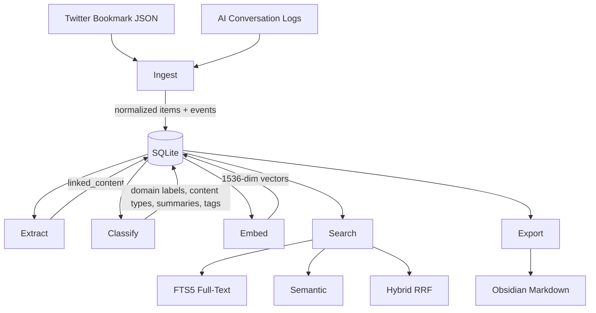

# Architecture

IdeaBank is a six-stage pipeline with SQLite at the center. Each stage is independent. Any stage can be re-run without affecting the others, and failures in one stage do not cascade.

## Pipeline Overview



## Stage Details

The code snippets in this document are illustrative pseudocode. They show the shape of the implementation, not exact copies of the source.

### 1. Ingest

Parses Twitter bookmark JSON exports and AI conversation logs (ChatGPT, Claude). Each raw input gets fingerprinted and stored in `raw_ingestions` for deduplication. Re-importing the same export is skipped unless forced.

The ingestion process:
1. Parse the source format (Twitter JSON, conversation export, etc.)
2. Fingerprint the raw data (SHA-256 of content)
3. Check `raw_ingestions` for duplicates
4. Create normalized `items` records with canonical URIs
5. Write `events` entries for the activity log
6. Update `source_state` watermarks for incremental ingestion

**Canonicalization** is important here. Twitter URLs get unwrapped (`t.co -> actual URL`), query params get stripped, and trailing slashes get normalized. This prevents the same link from appearing as different items.

```python
async def ingest_twitter(db: Database, path: Path) -> IngestResult:
    raw = path.read_text()
    fingerprint = hashlib.sha256(raw.encode()).hexdigest()

    if await db.raw_ingestion_exists(fingerprint):
        return IngestResult(skipped=True, reason="duplicate")

    bookmarks = parse_twitter_json(raw)
    items = [normalize_bookmark(b) for b in bookmarks]
    # ... canonicalize, dedupe, insert
```

### 2. Extract

Scans already-ingested items for URLs in their text and metadata, then routes each discovered URL to a domain-specific extractor. Users do not feed URLs directly to this stage. `ib extract` operates on URLs found inside items that were already ingested from Twitter bookmarks or conversation logs.

The router inspects each discovered URL and picks the right extractor. arXiv papers use the arXiv extractor, GitHub repositories use the GitHub extractor, and everything else falls through to the generic article extractor.

All extraction is async via `httpx` with concurrency limits, 3 simultaneous requests by default. Extracted content lands in the `linked_content` table.

See [Extractors](Extractors.md) for details on each extractor.

### 3. Classify

Sends item text to `gpt-4.1-mini` with a custom taxonomy prompt. The stored classification record includes:

- **domain**: Primary category (for example, `ai-ml`, `software-eng`, `finance-quant`)
- **domain_secondary**: Optional secondary category when content spans two domains
- **content_type**: High-level kind such as `paper`, `repo`, `article`, `thread`, or `tweet`
- **summary**: Short description of the key idea
- **tags**: A small set of relevant tags
- **confidence**: `1.0` for validated model output, lower for heuristic fallback

Classifications are stored in the `classifications` table. The stored record includes normalized labels, the model name, and a content hash used to skip unchanged items. The raw LLM response is not persisted.

```python
CLASSIFY_PROMPT = """Classify this item into the available domains and content types.

Return JSON with: domain, domain_secondary, content_type, summary, tags.
Use null for domain_secondary when it does not apply.

Item text:
{text}"""
```

`gpt-4.1-mini` is the default because this stage is repeated labeling work, not deep reasoning. Cost scales with token volume, and the batch classifier estimates the spend before execution.

### 4. Embed

Generates vector embeddings using OpenAI's `text-embedding-3-small` model (1,536 dimensions by default). Processing happens in batches of 500 items by default to stay within rate limits and manage memory.

The embedding input combines the item title, author, main text representation, optional classification summary, and optional linked content text. This gives the vector a richer signal than the title alone.

```python
async def embed_batch(items: list[Item], client: AsyncOpenAI) -> list[Embedding]:
    texts = [build_embedding_text(item) for item in items]
    response = await client.embeddings.create(
        model="text-embedding-3-small",
        input=texts,
    )
    return [
        Embedding(item_id=item.id, embedding_model="text-embedding-3-small",
                  dimensions=1536, embedding_json=e.embedding)
        for item, e in zip(items, response.data)
    ]
```

Embeddings are stored in the `embeddings` table, with the vector serialized in `embedding_json`. Storage grows linearly with the number of embedded items and the chosen dimensions.

### 5. Search

Three modes with different tradeoffs. See [Search](Search.md) for the full breakdown.

- **FTS5**: Fast keyword matching with BM25 ranking
- **Semantic**: Cosine similarity over embeddings
- **Hybrid (RRF)**: Combines both with Reciprocal Rank Fusion

### 6. Export

Renders items to Obsidian-compatible Markdown files with YAML frontmatter, tags, and wiki-links. The export respects Obsidian conventions:

```markdown
---
title: "Attention Is All You Need"
domain: ai-ml
tags: [transformers, attention, nlp]
source: https://arxiv.org/abs/1706.03762
created: 2024-03-15
---

# Attention Is All You Need

Summary from classification...

## Extracted Content

Full paper abstract...

## Related
- [other related item](other-related-item.md)
```

Tags become Obsidian tags, domains map to folders, and links between items become wiki-links. The result is a browsable, graph-connected knowledge base.

## Design Decisions

**Why SQLite?** It fits a single-user knowledge base well. No server to manage, the entire database is one file, WAL mode gives strong read concurrency, and FTS5 is built in. Typical local knowledge-base workloads are far below SQLite's practical limits.

**Why async?** Extraction is network-bound because it fetches URLs discovered inside ingested items. Async lets the system run several requests concurrently without threads. Classification and embedding are also external-call-bound, so async helps there too.

**Why stages instead of a single pipeline?** Each stage can fail independently. If the arXiv extractor breaks, classification of items that already have text can still proceed. Stages also make it possible to re-run one part of the pipeline, such as reclassifying everything with an updated prompt, without re-extracting.

## Navigation

- [Home](Home.md): Back to main page
- [Database Schema](Database-Schema.md): Table definitions and relationships
- [Search](Search.md): Search modes in detail
- [Extractors](Extractors.md): Content extraction system
- [CLI Reference](CLI-Reference.md): Running the pipeline
