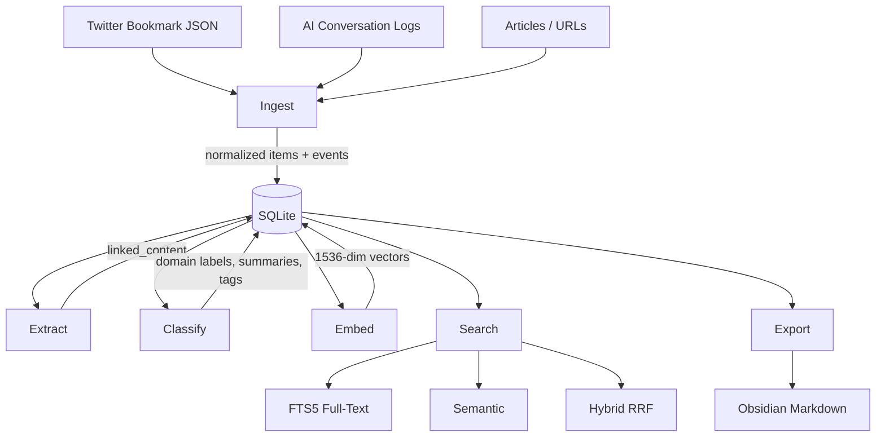

# Architecture

IdeaBank is a six-stage pipeline with SQLite at the center. Each stage is independent — you can re-run any stage without affecting the others, and failures in one stage don't cascade.

## Pipeline Overview



## Stage Details

### 1. Ingest

Parses Twitter bookmark JSON exports and AI conversation logs (ChatGPT, Claude). Each raw input gets fingerprinted and stored in `raw_ingestions` for deduplication — if I accidentally import the same export twice, nothing happens.

The ingestion process:
1. Parse the source format (Twitter JSON, conversation export, etc.)
2. Fingerprint the raw data (SHA-256 of content)
3. Check `raw_ingestions` for duplicates
4. Create normalized `items` records with canonical URIs
5. Write `events` entries for the activity log
6. Update `source_state` watermarks for incremental ingestion

**Canonicalization** is important here. Twitter URLs get unwrapped (t.co → actual URL), query params get stripped, and trailing slashes get normalized. This prevents the same link from appearing as three different items.

```python
async def ingest_twitter(db: Database, path: Path) -> IngestResult:
    raw = path.read_text()
    fingerprint = hashlib.sha256(raw.encode()).hexdigest()

    if await db.raw_ingestion_exists(fingerprint):
        return IngestResult(skipped=True, reason="duplicate")

    bookmarks = parse_twitter_json(raw)
    items = [normalize_bookmark(b) for b in bookmarks]
    # ... canonicalize, dedupe, insert
```

### 2. Extract

Routes URLs to domain-specific extractors. The router inspects the URL and picks the right extractor — arXiv papers get the arXiv extractor, GitHub repos get the GitHub extractor, everything else falls through to the generic article extractor.

All extraction is async via httpx with concurrency limits (10 simultaneous requests by default). Extracted content lands in the `linked_content` table.

See [Extractors](Extractors.md) for details on each extractor.

### 3. Classify

Sends item text to GPT-4.1-mini with a custom taxonomy prompt. The model returns structured JSON with:

- **domain**: Primary category (e.g., "machine-learning", "systems-programming", "finance")
- **summary**: 1-2 sentence description
- **tags**: 3-8 relevant tags
- **confidence**: Float 0-1

Classifications are stored in the `classifications` table with the raw LLM response for debugging. If a classification looks wrong, I can inspect exactly what the model saw and returned.

```python
CLASSIFY_PROMPT = """Classify this item into one of these domains: {domains}

Return JSON with: domain, summary, tags (list), confidence (0-1).
Only use domains from the list. If unsure, use "general" with low confidence.

Item text:
{text}"""
```

I chose GPT-4.1-mini here because classification doesn't need deep reasoning — it needs to be fast and cheap across thousands of items. At ~$0.001 per item, classifying all 5,808 items costs about $6.

### 4. Embed

Generates vector embeddings using OpenAI's text-embedding-3-small (1,536 dimensions). Processing happens in batches of 500 items to stay within rate limits and manage memory.

The embedding input is a concatenation of the item title, any extracted text, and the classification summary. This gives the vector a richer signal than just the title alone.

```python
async def embed_batch(items: list[Item], client: AsyncOpenAI) -> list[Embedding]:
    texts = [build_embedding_text(item) for item in items]
    response = await client.embeddings.create(
        model="text-embedding-3-small",
        input=texts,
    )
    return [
        Embedding(item_id=item.id, model="text-embedding-3-small",
                  dimensions=1536, vector=e.embedding)
        for item, e in zip(items, response.data)
    ]
```

Embeddings are stored as binary blobs in the `embeddings` table. At 1,536 floats × 4 bytes = ~6KB per item, the full 5,808-item collection is about 35MB of vectors.

### 5. Search

Three modes with different tradeoffs. See [Search](Search.md) for the full breakdown.

- **FTS5**: Fast keyword matching with BM25 ranking
- **Semantic**: Cosine similarity over embeddings
- **Hybrid (RRF)**: Combines both with Reciprocal Rank Fusion

### 6. Export

Renders items to Obsidian-compatible Markdown files with YAML frontmatter, tags, and wiki-links. The export respects Obsidian conventions:

```markdown
---
title: "Attention Is All You Need"
domain: machine-learning
tags: [transformers, attention, nlp]
source: https://arxiv.org/abs/1706.03762
created: 2024-03-15
---

# Attention Is All You Need

Summary from classification...

## Extracted Content

Full paper abstract...

## Related
- [other related item](other-related-item.md)
```

Tags become Obsidian tags, domains map to folders, and links between items become wiki-links. The result is a browsable, graph-connected knowledge base.

## Design Decisions

**Why SQLite?** It's the right tool for a single-user knowledge base. No server to manage, the entire database is one file, WAL mode gives great read concurrency, and FTS5 is built in. At 5,808 items, we're nowhere near SQLite's limits.

**Why async?** Extraction is I/O-bound — we're fetching hundreds of URLs. Async lets us run 10 requests concurrently without threads. Classification and embedding are also I/O-bound (API calls), so async helps there too.

**Why stages instead of a single pipeline?** Each stage can fail independently. If the arXiv extractor breaks, I don't want that to block classification of items that already have text. Stages also let me re-run just one part of the pipeline — re-classify everything with an updated prompt without re-extracting.

## Navigation

- [Home](Home.md) — Back to main page
- [Database Schema](Database-Schema.md) — Table definitions and relationships
- [Search](Search.md) — Search modes in detail
- [Extractors](Extractors.md) — Content extraction system
- [CLI Reference](CLI-Reference.md) — Running the pipeline
