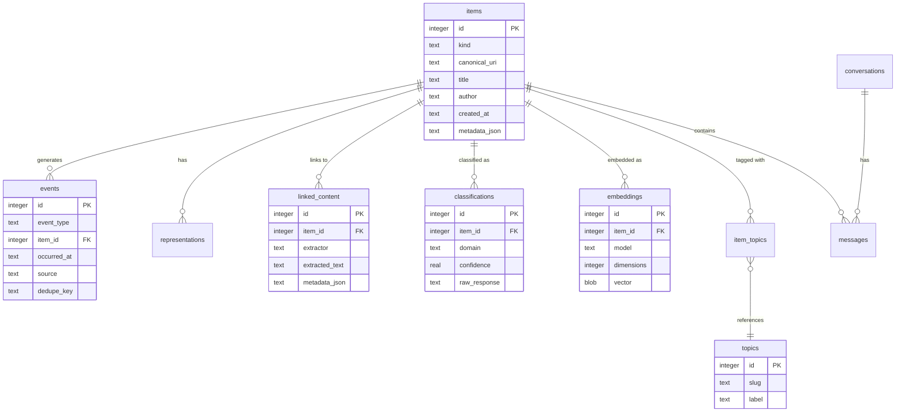

# Database Schema

IdeaBank uses SQLite with 14 tables, FTS5 virtual tables for full-text search, and a handful of pragmas that make everything fast. The database file typically sits at `~/.ideabank/ideabank.db`.

## SQLite Configuration

```sql
PRAGMA journal_mode = WAL;        -- Write-Ahead Logging for concurrent reads
PRAGMA synchronous = NORMAL;      -- Fsync on checkpoint, not every commit
PRAGMA foreign_keys = ON;         -- Actually enforce FK constraints
PRAGMA busy_timeout = 5000;       -- Wait 5s on lock instead of failing immediately
```

WAL mode is the big one — it means search queries never block ingestion, and vice versa.

## Entity Relationship Diagram

Here are the core relationships (simplified to the key tables):



## All 14 Tables

### items

The core table. Every bookmark, conversation, article — everything is an item.

| Column | Type | Notes |
|---|---|---|
| id | INTEGER | Primary key, autoincrement |
| kind | TEXT | "bookmark", "conversation", "article" |
| canonical_uri | TEXT | Normalized URL (unique) |
| title | TEXT | Item title, nullable |
| author | TEXT | Author/creator, nullable |
| created_at | TEXT | ISO 8601 timestamp |
| updated_at | TEXT | ISO 8601 timestamp |
| metadata_json | TEXT | Flexible JSON blob for source-specific data |

The `canonical_uri` column has a unique index. This is what prevents duplicates — two different Twitter bookmark exports with the same underlying URL resolve to the same canonical URI.

```sql
CREATE UNIQUE INDEX idx_items_canonical_uri ON items(canonical_uri);
```

### events

Append-only activity log. Every meaningful thing that happens gets an event — ingestion, extraction, classification, export, errors. This is the audit trail.

| Column | Type | Notes |
|---|---|---|
| id | INTEGER | Primary key |
| event_type | TEXT | "ingested", "extracted", "classified", "exported", "error" |
| item_id | INTEGER | FK → items, nullable (some events are global) |
| occurred_at | TEXT | ISO 8601 timestamp |
| source | TEXT | What triggered it ("cli", "scheduler", etc.) |
| payload_json | TEXT | Event-specific data |
| dedupe_key | TEXT | Prevents duplicate events |

The `dedupe_key` is a hash of the event type + item ID + relevant content. If the same extraction runs twice on the same item, only one event gets recorded.

### source_state

Watermarks for incremental ingestion. Tracks the last-seen timestamp or offset for each source so we only process new data on subsequent runs.

| Column | Type | Notes |
|---|---|---|
| source_name | TEXT | Primary key ("twitter", "chatgpt", etc.) |
| last_sync_at | TEXT | ISO 8601 timestamp |
| cursor | TEXT | Source-specific cursor/offset |
| metadata_json | TEXT | Additional state |

### representations

Text representations of items. An item might have its original tweet text, extracted article text, a cleaned version, etc. Multiple representations per item.

| Column | Type | Notes |
|---|---|---|
| id | INTEGER | Primary key |
| item_id | INTEGER | FK → items |
| kind | TEXT | "original_text", "extracted_text", "cleaned_text" |
| content | TEXT | The actual text |
| created_at | TEXT | ISO 8601 timestamp |

### annotations

User-added notes on items. These are things I manually attach — "this is relevant to project X" or "follow up on this".

| Column | Type | Notes |
|---|---|---|
| id | INTEGER | Primary key |
| item_id | INTEGER | FK → items |
| body | TEXT | Annotation text |
| created_at | TEXT | ISO 8601 timestamp |

### topics

Topic slugs for categorization. A flat list (not hierarchical) — things like "machine-learning", "distributed-systems", "career".

| Column | Type | Notes |
|---|---|---|
| id | INTEGER | Primary key |
| slug | TEXT | URL-safe identifier (unique) |
| label | TEXT | Human-readable name |

### item_topics

Many-to-many join between items and topics. An item can have multiple topics, a topic can have many items.

| Column | Type | Notes |
|---|---|---|
| item_id | INTEGER | FK → items |
| topic_id | INTEGER | FK → topics |

Composite primary key on (item_id, topic_id).

### conversations

Links items to conversation records. When I ingest a ChatGPT or Claude conversation, the conversation itself is tracked here, and the individual messages go in `messages`.

| Column | Type | Notes |
|---|---|---|
| id | INTEGER | Primary key |
| item_id | INTEGER | FK → items |
| source | TEXT | "chatgpt", "claude", "gemini" |
| external_id | TEXT | ID from the source platform |
| started_at | TEXT | ISO 8601 timestamp |

### messages

Individual messages within conversations.

| Column | Type | Notes |
|---|---|---|
| id | INTEGER | Primary key |
| conversation_id | INTEGER | FK → conversations |
| role | TEXT | "user", "assistant", "system" |
| content | TEXT | Message text |
| position | INTEGER | Order within conversation |
| created_at | TEXT | ISO 8601 timestamp |

### raw_ingestions

Fingerprinted raw data for deduplication. Before parsing anything, we store the SHA-256 of the raw input. If we've seen that fingerprint before, we skip the entire file.

| Column | Type | Notes |
|---|---|---|
| id | INTEGER | Primary key |
| fingerprint | TEXT | SHA-256 hash (unique) |
| source | TEXT | "twitter_json", "chatgpt_export", etc. |
| ingested_at | TEXT | ISO 8601 timestamp |
| item_count | INTEGER | How many items were in this batch |

### linked_content

Extracted content from URLs. When an item contains a URL, the extractor fetches it and stores the result here.

| Column | Type | Notes |
|---|---|---|
| id | INTEGER | Primary key |
| item_id | INTEGER | FK → items |
| url | TEXT | The URL that was fetched |
| extractor | TEXT | "article", "arxiv", "github", "youtube" |
| extracted_text | TEXT | Main text content |
| metadata_json | TEXT | Extractor-specific structured data |
| fetched_at | TEXT | ISO 8601 timestamp |

### classifications

LLM-assigned labels and metadata.

| Column | Type | Notes |
|---|---|---|
| id | INTEGER | Primary key |
| item_id | INTEGER | FK → items (unique — one classification per item) |
| domain | TEXT | Primary domain label |
| summary | TEXT | 1-2 sentence summary |
| tags_json | TEXT | JSON array of tags |
| confidence | REAL | 0.0 to 1.0 |
| model | TEXT | Which model was used |
| raw_response | TEXT | Full LLM response for debugging |
| classified_at | TEXT | ISO 8601 timestamp |

### embeddings

Vector embeddings stored as binary blobs.

| Column | Type | Notes |
|---|---|---|
| id | INTEGER | Primary key |
| item_id | INTEGER | FK → items (unique per model) |
| model | TEXT | "text-embedding-3-small" |
| dimensions | INTEGER | 1536 |
| vector | BLOB | Binary float32 array |
| created_at | TEXT | ISO 8601 timestamp |

The vector is stored as a packed binary array (`struct.pack('f' * 1536, *embedding)`). At query time, we unpack and compute cosine similarity in Python. It's not as fast as a dedicated vector DB, but for 5,808 items it takes about 50ms — totally fine.

### schema_migrations

Version tracking for database migrations.

| Column | Type | Notes |
|---|---|---|
| version | INTEGER | Migration version number |
| applied_at | TEXT | ISO 8601 timestamp |
| description | TEXT | What this migration did |

## FTS5 Virtual Tables

Full-text search uses SQLite's FTS5 extension:

```sql
CREATE VIRTUAL TABLE items_fts USING fts5(
    title,
    content,
    content=items,
    content_rowid=id,
    tokenize='porter unicode61'
);
```

The `porter` tokenizer applies stemming (so "running" matches "run"), and `unicode61` handles Unicode normalization. The FTS index is kept in sync with triggers on the `items` table.

See [Search](Search.md) for how FTS5 is used in queries.

## Navigation

- [Home](Home.md) — Back to main page
- [Architecture](Architecture.md) — Pipeline design
- [Search](Search.md) — How the search modes use these tables
- [CLI Reference](CLI-Reference.md) — Commands that read/write these tables
