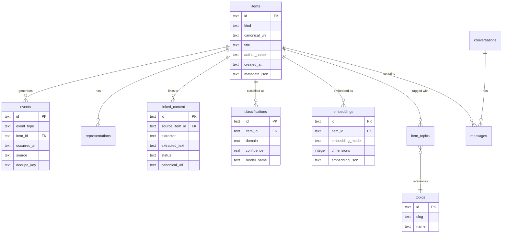

# Database Schema

IdeaBank schema v4.0 uses SQLite with 14 tables, FTS5 virtual tables for full-text search, and a handful of pragmas that make everything fast. The database file typically sits at `~/.ideabank/ideabank.db`.

This schema is illustrative. The authoritative schema is defined in `src/ideabank/core/database.py`.

FTS5 virtual tables are maintained with triggers for automatic indexing.

## SQLite Configuration

```sql
PRAGMA journal_mode = WAL;        -- Write-Ahead Logging for concurrent reads
PRAGMA synchronous = NORMAL;      -- Fsync on checkpoint, not every commit
PRAGMA foreign_keys = ON;         -- Actually enforce FK constraints
PRAGMA busy_timeout = 5000;       -- Wait 5s on lock instead of failing immediately
```

WAL mode is the key setting. It means search queries never block ingestion, and vice versa.

## Entity Relationship Diagram

Here are the core relationships, simplified to the key tables:



## All 14 Tables

### items

The core table. Every bookmark, conversation, article, and related object is stored as an item.

| Column | Type | Notes |
|---|---|---|
| item_rowid | INTEGER | Internal SQLite rowid primary key, used by FTS |
| id | TEXT | Unique ULID identifier |
| kind | TEXT | Item kind such as "bookmark", "conversation", or "article" |
| canonical_uri | TEXT | Normalized URL or canonical identifier, unique, nullable |
| canonicalizer_version | TEXT | Canonicalization ruleset version, default `'1'` |
| title | TEXT | Item title, nullable |
| author_name | TEXT | Author or creator name, nullable |
| author_handle | TEXT | Source-specific author handle, nullable |
| author_uri | TEXT | Source-specific author URI, nullable |
| created_at | TEXT | Source timestamp, nullable |
| first_seen_at | TEXT | ISO 8601 timestamp when first stored |
| updated_at | TEXT | ISO 8601 timestamp when last updated |
| metadata_json | TEXT | Flexible JSON blob for source-specific data |

The `canonical_uri` column has a unique index. This prevents duplicates; two imports with the same underlying canonical URI resolve to the same item.

```sql
CREATE UNIQUE INDEX idx_items_canonical_uri ON items(canonical_uri);
```

### events

Append-only activity log. Every meaningful system event is recorded here, including ingestion, extraction, classification, export, and errors.

| Column | Type | Notes |
|---|---|---|
| event_rowid | INTEGER | Internal SQLite rowid primary key |
| id | TEXT | Unique ULID identifier |
| event_type | TEXT | Event type such as "ingested", "extracted", "classified", "exported", or "error" |
| item_id | TEXT | FK → items.id |
| occurred_at | TEXT | ISO 8601 timestamp |
| source | TEXT | Trigger source such as "cli" or "scheduler" |
| context_json | TEXT | Event-specific JSON data, nullable |
| dedupe_key | TEXT | Prevents duplicate events when combined with source and event_type, nullable |

The `dedupe_key` participates in a partial unique index on `(source, event_type, dedupe_key)` when `dedupe_key` is not `NULL`.

### source_state

Watermarks for incremental ingestion. Tracks per-source timestamps, file hashes, and serialized state so later runs can resume efficiently.

| Column | Type | Notes |
|---|---|---|
| source | TEXT | Primary key |
| last_checked_at | TEXT | ISO 8601 timestamp, nullable |
| last_ingested_at | TEXT | ISO 8601 timestamp, nullable |
| watermark_occurred_at | TEXT | Source watermark timestamp, nullable |
| last_file_hash | TEXT | Last processed file hash, nullable |
| state_json | TEXT | Additional source state as JSON, nullable |

### representations

Text and structured representations of items. An item can have multiple derived or source representations.

| Column | Type | Notes |
|---|---|---|
| rep_rowid | INTEGER | Internal SQLite rowid primary key |
| id | TEXT | Unique ULID identifier |
| item_id | TEXT | FK → items.id |
| rep_type | TEXT | Representation type such as "original_text" or "extracted_text" |
| content_text | TEXT | Text form, nullable |
| content_json | TEXT | Structured JSON form, nullable |
| source_rep_id | TEXT | FK → representations.id, nullable |
| processor | TEXT | Component that produced this representation, nullable |
| processor_version | TEXT | Processor version, nullable |
| content_hash | TEXT | Hash of representation content, nullable |
| created_at | TEXT | ISO 8601 timestamp |

### annotations

User-added notes and review metadata for items.

| Column | Type | Notes |
|---|---|---|
| annotation_rowid | INTEGER | Internal SQLite rowid primary key |
| id | TEXT | Unique ULID identifier |
| item_id | TEXT | FK → items.id, unique |
| note_text | TEXT | Annotation text, nullable |
| tags_json | TEXT | JSON array of tags, nullable |
| rating | INTEGER | Optional rating from 1 to 5 |
| stage | TEXT | Workflow stage, default `'inbox'` |
| created_at | TEXT | ISO 8601 timestamp |
| updated_at | TEXT | ISO 8601 timestamp |
| obsidian_path | TEXT | Exported note path, nullable |
| obsidian_hash | TEXT | Export hash, nullable |
| exported_at | TEXT | ISO 8601 timestamp, nullable |

### topics

Topic definitions for categorization. Topics are flat by default, with optional parent links for grouping.

| Column | Type | Notes |
|---|---|---|
| topic_rowid | INTEGER | Internal SQLite rowid primary key |
| id | TEXT | Unique ULID identifier |
| name | TEXT | Human-readable name, unique |
| slug | TEXT | URL-safe identifier, unique |
| parent_id | TEXT | FK → topics.id, nullable |
| patterns_json | TEXT | JSON detection patterns, nullable |
| accounts_json | TEXT | JSON account matchers, nullable |
| color | TEXT | Optional display color |
| created_at | TEXT | ISO 8601 timestamp |

### item_topics

Many-to-many join between items and topics. An item can have multiple topics, and a topic can be attached to many items.

| Column | Type | Notes |
|---|---|---|
| item_id | TEXT | FK → items.id |
| topic_id | TEXT | FK → topics.id |
| confidence | REAL | Match confidence, default `1.0` |
| source | TEXT | Assignment source, default `'pattern'` |
| created_at | TEXT | ISO 8601 timestamp |

Composite primary key on `(item_id, topic_id)`.

### conversations

First-class conversation metadata. Conversation items map to this table, and individual messages are stored in `messages`.

| Column | Type | Notes |
|---|---|---|
| conversation_rowid | INTEGER | Internal SQLite rowid primary key |
| id | TEXT | Unique ULID identifier |
| item_id | TEXT | FK → items.id, unique |
| platform | TEXT | Conversation platform such as "chatgpt", "claude", or "gemini" |
| model | TEXT | Model name, nullable |
| title | TEXT | Conversation title, nullable |
| started_at | TEXT | ISO 8601 timestamp, nullable |
| ended_at | TEXT | ISO 8601 timestamp, nullable |
| summary_text | TEXT | Conversation summary, nullable |
| key_insights_json | TEXT | JSON array or object of extracted insights, nullable |

### messages

Individual messages within conversations.

| Column | Type | Notes |
|---|---|---|
| message_rowid | INTEGER | Internal SQLite rowid primary key |
| id | TEXT | Unique ULID identifier |
| conversation_id | TEXT | FK → conversations.id |
| role | TEXT | Message role such as "user", "assistant", or "system" |
| content_text | TEXT | Message text, nullable |
| content_json | TEXT | Structured message payload, nullable |
| message_index | INTEGER | Order within the conversation |
| created_at | TEXT | ISO 8601 timestamp |

Unique index on `(conversation_id, message_index)`.

### raw_ingestions

Fingerprinted raw data for deduplication. The source file metadata and hash are stored before parsing so repeated imports can be skipped.

| Column | Type | Notes |
|---|---|---|
| ingestion_rowid | INTEGER | Internal SQLite rowid primary key |
| id | TEXT | Unique ULID identifier |
| source | TEXT | Source identifier such as "twitter_json" or "chatgpt_export" |
| file_path | TEXT | Imported file path |
| file_hash | TEXT | Source file hash, unique |
| record_count | INTEGER | Number of records discovered, nullable |
| schema_version | TEXT | Source schema version, nullable |
| imported_at | TEXT | ISO 8601 timestamp |

### linked_content

Extracted content from URLs. When an item references a URL, the extractor fetches it and stores the result here.

| Column | Type | Notes |
|---|---|---|
| lc_rowid | INTEGER | Internal SQLite rowid primary key |
| id | TEXT | Unique ULID identifier |
| source_item_id | TEXT | FK → items.id |
| url | TEXT | Original fetched URL |
| canonical_url | TEXT | Canonicalized URL |
| domain | TEXT | Extracted domain, nullable |
| content_type | TEXT | MIME-like content type, nullable |
| title | TEXT | Extracted title, nullable |
| extracted_text | TEXT | Main text content, nullable |
| word_count | INTEGER | Extracted word count, default `0` |
| extractor | TEXT | Extractor name, nullable |
| status | TEXT | Extraction state, default `'pending'` |
| error_message | TEXT | Extraction error, nullable |
| content_hash | TEXT | Extracted content hash, nullable |
| created_at | TEXT | ISO 8601 timestamp |
| updated_at | TEXT | ISO 8601 timestamp |

Unique constraint on `(source_item_id, canonical_url)`.

### classifications

LLM-assigned labels and metadata.

| Column | Type | Notes |
|---|---|---|
| cls_rowid | INTEGER | Internal SQLite rowid primary key |
| id | TEXT | Unique ULID identifier |
| item_id | TEXT | FK → items.id, unique |
| domain | TEXT | Primary domain label |
| domain_secondary | TEXT | Secondary domain label, nullable |
| content_type | TEXT | Classified content type |
| summary | TEXT | Short summary, nullable |
| tags_json | TEXT | JSON array of tags, nullable |
| confidence | REAL | 0.0 to 1.0, default `1.0` |
| model_name | TEXT | Model name, nullable |
| content_hash | TEXT | Hash of classified content, nullable |
| created_at | TEXT | ISO 8601 timestamp |
| updated_at | TEXT | ISO 8601 timestamp |

### embeddings

Vector embeddings stored as serialized JSON.

| Column | Type | Notes |
|---|---|---|
| emb_rowid | INTEGER | Internal SQLite rowid primary key |
| id | TEXT | Unique ULID identifier |
| item_id | TEXT | FK → items.id |
| embedding_model | TEXT | Embedding model name such as "text-embedding-3-small" |
| dimensions | INTEGER | Embedding dimensionality |
| embedding_json | TEXT | Serialized embedding payload |
| source_text_hash | TEXT | Hash of the source text used for embedding, nullable |
| token_count | INTEGER | Token count used to create the embedding, nullable |
| created_at | TEXT | ISO 8601 timestamp |

Embeddings are stored in `embedding_json`. Similarity calculations can still be performed in application code, which remains practical for modest collection sizes.

### schema_migrations

Version tracking for database migrations.

| Column | Type | Notes |
|---|---|---|
| version | TEXT | Schema version identifier |
| applied_at | TEXT | ISO 8601 timestamp |

The current application schema version is `4.0`.

## FTS5 Virtual Tables

Full-text search uses SQLite's FTS5 extension:

```sql
CREATE VIRTUAL TABLE items_fts USING fts5(
    title,
    content,
    content=items,
    content_rowid=id,
    tokenize='porter unicode61'
);
```

The `porter` tokenizer applies stemming (so "running" matches "run"), and `unicode61` handles Unicode normalization. The FTS index is kept in sync with triggers on the `items` table.

See [Search](Search.md) for how FTS5 is used in queries.

## Navigation

- [Home](Home.md), back to main page
- [Architecture](Architecture.md), pipeline design
- [Search](Search.md), how the search modes use these tables
- [CLI Reference](CLI-Reference.md), commands that read and write these tables
