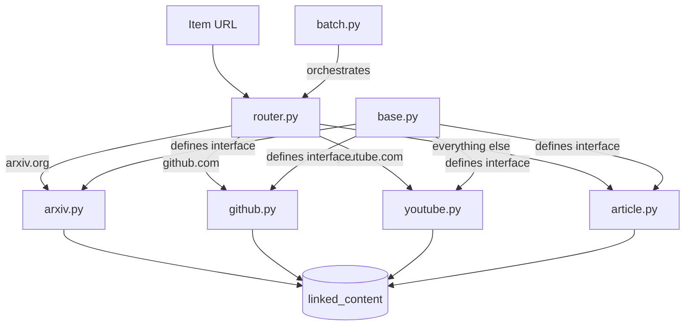

# Extractors

The extraction system fetches and parses linked URLs from ingested items. It's organized around domain-specific extractors — each one knows how to handle a particular type of URL and pull out structured content.

All extractors live in `src/ideabank/extractors/` and share a common async interface.

## Overview



## base.py — Abstract Base Class

All extractors inherit from `BaseExtractor`. This defines the interface and provides shared functionality like HTTP client setup and error handling.

```python
class BaseExtractor(ABC):
    def __init__(self, client: httpx.AsyncClient):
        self.client = client

    @abstractmethod
    def can_handle(self, url: str) -> bool:
        """Return True if this extractor handles the given URL."""
        ...

    @abstractmethod
    async def extract(self, url: str) -> ExtractResult:
        """Fetch and parse the URL. Return structured content."""
        ...

    @property
    @abstractmethod
    def extractor_name(self) -> str:
        """Identifier stored in linked_content.extractor column."""
        ...
```

`ExtractResult` is a dataclass:

```python
@dataclass
class ExtractResult:
    url: str
    extracted_text: str
    metadata: dict[str, Any]
    success: bool
    error: str | None = None
```

Every extractor returns this same shape. The `metadata` dict holds extractor-specific fields (star count for GitHub, video duration for YouTube, etc.), while `extracted_text` is always plain text suitable for classification and embedding.

## router.py — URL Routing

The router maintains a list of extractors in priority order and picks the first one that returns `True` from `can_handle()`.

```python
class ExtractorRouter:
    def __init__(self, client: httpx.AsyncClient):
        self.extractors: list[BaseExtractor] = [
            ArxivExtractor(client),
            GitHubExtractor(client),
            YouTubeExtractor(client),
            ArticleExtractor(client),  # fallback — handles everything
        ]

    def route(self, url: str) -> BaseExtractor:
        for extractor in self.extractors:
            if extractor.can_handle(url):
                return extractor
        # ArticleExtractor.can_handle() always returns True,
        # so we never actually reach here
        raise ValueError(f"No extractor for {url}")
```

Order matters. The `ArticleExtractor` is last because it's the fallback — it handles any URL. Domain-specific extractors are checked first so an arXiv URL doesn't get treated as a generic article.

## article.py — Generic Article Extraction

The workhorse extractor. Handles any webpage by fetching the HTML and running it through readability to pull out the main content, stripping ads, navigation, and boilerplate.

```python
class ArticleExtractor(BaseExtractor):
    extractor_name = "article"

    def can_handle(self, url: str) -> bool:
        return True  # fallback for everything

    async def extract(self, url: str) -> ExtractResult:
        response = await self.client.get(url, follow_redirects=True, timeout=30.0)
        response.raise_for_status()

        doc = readability.Document(response.text)
        title = doc.title()
        content = doc.summary()  # HTML of main content
        text = html_to_text(content)  # Strip tags

        return ExtractResult(
            url=url,
            extracted_text=text,
            metadata={"title": title, "word_count": len(text.split())},
            success=True,
        )
```

Uses the `readability-lxml` library, which is a Python port of Mozilla's Readability.js. It does a good job on most blogs and news sites. Occasionally it grabs the wrong content block on sites with unusual layouts, but that's rare enough that I haven't needed a fallback.

## arxiv.py — ArXiv Paper Extraction

Pulls metadata and abstracts from arXiv papers using their API.

```python
class ArxivExtractor(BaseExtractor):
    extractor_name = "arxiv"

    def can_handle(self, url: str) -> bool:
        return "arxiv.org" in url

    async def extract(self, url: str) -> ExtractResult:
        arxiv_id = self._parse_arxiv_id(url)  # e.g., "2301.07041"
        api_url = f"http://export.arxiv.org/api/query?id_list={arxiv_id}"

        response = await self.client.get(api_url, timeout=15.0)
        entry = parse_atom_entry(response.text)

        text = f"{entry.title}\n\n{entry.abstract}"

        return ExtractResult(
            url=url,
            extracted_text=text,
            metadata={
                "arxiv_id": arxiv_id,
                "title": entry.title,
                "authors": entry.authors,
                "categories": entry.categories,
                "published": entry.published,
                "pdf_url": entry.pdf_url,
            },
            success=True,
        )
```

The arXiv API returns Atom XML. I parse it with `xml.etree.ElementTree` rather than pulling in a full XML library. The extractor handles both `arxiv.org/abs/XXXX` and `arxiv.org/pdf/XXXX` URL formats.

One gotcha: arXiv rate-limits API requests. The batch processor (below) respects this by throttling arXiv requests to 1 per 3 seconds.

## github.py — GitHub Repository Extraction

Fetches repo metadata from the GitHub API. Requires a `GITHUB_TOKEN` for higher rate limits, but works without one for public repos (at 60 requests/hour).

```python
class GitHubExtractor(BaseExtractor):
    extractor_name = "github"

    def can_handle(self, url: str) -> bool:
        return "github.com" in url and self._is_repo_url(url)

    async def extract(self, url: str) -> ExtractResult:
        owner, repo = self._parse_repo(url)  # e.g., ("pytorch", "pytorch")
        api_url = f"https://api.github.com/repos/{owner}/{repo}"

        headers = {"Accept": "application/vnd.github.v3+json"}
        if token := os.environ.get("GITHUB_TOKEN"):
            headers["Authorization"] = f"token {token}"

        response = await self.client.get(api_url, headers=headers, timeout=15.0)
        data = response.json()

        text = f"{data['full_name']}: {data['description'] or 'No description'}"
        if data.get("topics"):
            text += f"\nTopics: {', '.join(data['topics'])}"

        return ExtractResult(
            url=url,
            extracted_text=text,
            metadata={
                "full_name": data["full_name"],
                "description": data["description"],
                "stars": data["stargazers_count"],
                "forks": data["forks_count"],
                "language": data["language"],
                "languages_url": data["languages_url"],
                "topics": data.get("topics", []),
                "created_at": data["created_at"],
                "updated_at": data["updated_at"],
            },
            success=True,
        )
```

The `can_handle` check uses `_is_repo_url()` to distinguish repo URLs from other GitHub URLs (issues, gists, profile pages). Non-repo GitHub URLs fall through to the article extractor.

## youtube.py — YouTube Video Extraction

Fetches video metadata and, when available, the transcript.

```python
class YouTubeExtractor(BaseExtractor):
    extractor_name = "youtube"

    def can_handle(self, url: str) -> bool:
        return "youtube.com/watch" in url or "youtu.be/" in url

    async def extract(self, url: str) -> ExtractResult:
        video_id = self._parse_video_id(url)

        # Fetch metadata via oEmbed (no API key needed)
        oembed_url = f"https://www.youtube.com/oembed?url=https://youtube.com/watch?v={video_id}&format=json"
        meta_response = await self.client.get(oembed_url, timeout=15.0)
        meta = meta_response.json()

        # Try to get transcript
        transcript_text = ""
        try:
            transcript = await self._fetch_transcript(video_id)
            transcript_text = " ".join(entry["text"] for entry in transcript)
        except TranscriptUnavailable:
            pass  # Not all videos have transcripts

        text = f"{meta['title']} by {meta['author_name']}"
        if transcript_text:
            text += f"\n\nTranscript:\n{transcript_text}"

        return ExtractResult(
            url=url,
            extracted_text=text,
            metadata={
                "video_id": video_id,
                "title": meta["title"],
                "author": meta["author_name"],
                "author_url": meta["author_url"],
                "has_transcript": bool(transcript_text),
                "transcript_length": len(transcript_text),
            },
            success=True,
        )
```

Transcript fetching uses the `youtube-transcript-api` library. When a transcript isn't available (private video, disabled captions), the extractor still returns the title and channel name — that's enough for classification and basic search.

## batch.py — Async Batch Processing

Orchestrates extraction across many items with concurrency control. This is what `ib extract` calls.

```python
class BatchExtractor:
    def __init__(
        self,
        db: Database,
        concurrency: int = 10,
        timeout: float = 30.0,
    ):
        self.db = db
        self.semaphore = asyncio.Semaphore(concurrency)
        self.timeout = timeout

    async def run(self, items: list[Item]) -> BatchResult:
        async with httpx.AsyncClient(timeout=self.timeout) as client:
            router = ExtractorRouter(client)
            tasks = [self._extract_one(router, item) for item in items]
            results = await asyncio.gather(*tasks, return_exceptions=True)

        success = sum(1 for r in results if isinstance(r, ExtractResult) and r.success)
        failed = len(results) - success
        return BatchResult(total=len(items), success=success, failed=failed)

    async def _extract_one(self, router: ExtractorRouter, item: Item) -> ExtractResult:
        async with self.semaphore:
            extractor = router.route(item.canonical_uri)
            result = await extractor.extract(item.canonical_uri)

            if result.success:
                await self.db.insert_linked_content(
                    item_id=item.id,
                    url=result.url,
                    extractor=extractor.extractor_name,
                    extracted_text=result.extracted_text,
                    metadata_json=json.dumps(result.metadata),
                )

            return result
```

The `asyncio.Semaphore` limits concurrent HTTP requests. Without it, firing off 5,808 requests simultaneously would get us rate-limited by every API and probably crash the event loop. At concurrency=10, extraction is fast without being obnoxious.

`asyncio.gather` with `return_exceptions=True` means one failed extraction doesn't kill the whole batch. Failed items get logged and can be retried on the next run.

## Adding a New Extractor

To add a new domain extractor:

1. Create `src/ideabank/extractors/newdomain.py`
2. Subclass `BaseExtractor`, implement `can_handle()`, `extract()`, and `extractor_name`
3. Add it to the `ExtractorRouter` list in `router.py` (before `ArticleExtractor`)
4. The rest of the pipeline (classify, embed, search) works automatically — no changes needed

```python
class RedditExtractor(BaseExtractor):
    extractor_name = "reddit"

    def can_handle(self, url: str) -> bool:
        return "reddit.com" in url

    async def extract(self, url: str) -> ExtractResult:
        # Fetch the JSON version of any Reddit URL
        json_url = url.rstrip("/") + ".json"
        response = await self.client.get(
            json_url,
            headers={"User-Agent": "IdeaBank/1.0"},
            timeout=15.0,
        )
        # ... parse and return ExtractResult
```

## Navigation

- [Home](Home.md) — Back to main page
- [Architecture](Architecture.md) — Where extraction fits in the pipeline
- [CLI Reference](CLI-Reference.md) — `ib extract` command
- [Database Schema](Database-Schema.md) — `linked_content` table where results are stored
