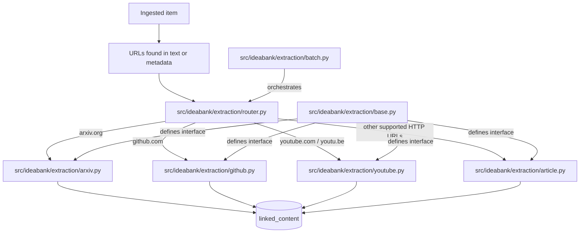

# Extractors

Note: extraction only runs on URLs discovered inside already-ingested items. The pipeline scans item text and metadata for links; it does not accept arbitrary URLs as direct input.

The extraction system fetches and parses linked URLs from ingested items. The current implementation has 4 extractors: article extraction with `trafilatura`, arXiv extraction via the Atom API, GitHub extraction via the REST API, and YouTube extraction via the transcript API.

All extractors live in `src/ideabank/extraction/` and share a common interface.

## Overview



## base.py - Abstract Base Class

All extractors inherit from `BaseExtractor`. The base module defines the shared interface and the `ExtractionResult` dataclass that flows through the rest of the pipeline.

```python
from abc import ABC, abstractmethod
from dataclasses import dataclass
from typing import Optional


@dataclass
class ExtractionResult:
    url: str
    canonical_url: str
    title: Optional[str] = None
    text: Optional[str] = None
    word_count: int = 0
    content_type: Optional[str] = None
    extractor: Optional[str] = None
    error: Optional[str] = None


class BaseExtractor(ABC):
    name: str = "base"

    @abstractmethod
    async def extract(self, url: str) -> ExtractionResult:
        """Extract content from a URL."""
        ...

    @abstractmethod
    def can_handle(self, url: str, domain: str) -> bool:
        """Check whether this extractor should handle the URL."""
        ...
```

`ExtractionResult.success` is derived from whether `text` is present and non-empty. Concrete extractors are responsible for fetching content, normalizing the canonical URL, and populating the result fields.

## router.py - URL Routing

The router keeps a module-level list of extractor instances in priority order and returns the first extractor whose `can_handle()` method matches the URL.

```python
_EXTRACTORS: list[BaseExtractor] = [
    ArxivExtractor(),
    YouTubeExtractor(),
    GitHubExtractor(),
    ArticleExtractor(),  # fallback, must be last
]


def route_url(url: str) -> Optional[BaseExtractor]:
    parsed = urlparse(url)
    domain = parsed.netloc.lower().replace("www.", "")

    for extractor in _EXTRACTORS:
        if extractor.can_handle(url, domain):
            return extractor
    return None
```

Order matters. `ArticleExtractor` is last because it is the generic fallback for remaining supported HTTP URLs. The specialized extractors are checked first so arXiv, GitHub, and YouTube URLs do not fall through to generic article extraction.

## article.py - Generic Article Extraction

The article extractor handles remaining HTTP URLs and uses `trafilatura` to pull main page content from HTML.

```python
class ArticleExtractor(BaseExtractor):
    name = "trafilatura"

    def can_handle(self, url: str, domain: str) -> bool:
        if domain in self.SKIP_DOMAINS:
            return False
        return url.startswith(("http://", "https://"))

    async def extract(self, url: str) -> ExtractionResult:
        result = ExtractionResult(
            url=url,
            canonical_url=url,
            extractor=self.name,
            content_type="article",
        )

        async with httpx.AsyncClient(
            follow_redirects=True,
            timeout=httpx.Timeout(15.0),
        ) as client:
            resp = await client.get(url)
            resp.raise_for_status()
            html = resp.text

        result.canonical_url = str(resp.url)
        text = trafilatura.extract(
            html,
            include_comments=False,
            include_tables=True,
            no_fallback=False,
            favor_recall=True,
        )

        result.text = text
        result.word_count = len(text.split()) if text else 0
        return result
```

The production implementation also skips a small set of social domains, rejects very short extractions, truncates very long text, and tries to recover a title from `trafilatura` metadata or the HTML `<title>` tag.

## arxiv.py - ArXiv Paper Extraction

Pulls abstracts and basic paper metadata from arXiv papers using the Atom API.

```python
class ArxivExtractor(BaseExtractor):
    name = "arxiv_api"

    def can_handle(self, url: str, domain: str) -> bool:
        return domain == "arxiv.org" and self._ARXIV_ID_PATTERN.search(url) is not None

    async def extract(self, url: str) -> ExtractionResult:
        paper_id = self._extract_paper_id(url)
        api_url = f"http://export.arxiv.org/api/query?id_list={paper_id}"

        async with httpx.AsyncClient(timeout=httpx.Timeout(15.0)) as client:
            resp = await client.get(api_url)
            resp.raise_for_status()
            xml = resp.text

        # Parse title, abstract, authors, and categories from the Atom XML
        ...
```

The extractor handles both `arxiv.org/abs/XXXX` and `arxiv.org/pdf/XXXX` URLs, then normalizes the stored canonical URL to `https://arxiv.org/abs/{paper_id}`. The current implementation parses the Atom response directly and builds a combined text block for downstream classification and embedding.

## github.py - GitHub Repository Extraction

Fetches repository metadata and README content from the GitHub REST API.

```python
class GitHubExtractor(BaseExtractor):
    name = "github_api"

    def can_handle(self, url: str, domain: str) -> bool:
        return domain == "github.com" and self._REPO_PATTERN.search(url) is not None

    async def extract(self, url: str) -> ExtractionResult:
        owner, repo = self._parse_repo(url)

        async with httpx.AsyncClient(
            timeout=httpx.Timeout(15.0),
            headers={
                "Accept": "application/vnd.github.v3+json",
                "User-Agent": "IdeaBank/1.0",
            },
        ) as client:
            repo_resp = await client.get(f"https://api.github.com/repos/{owner}/{repo}")
            readme_resp = await client.get(
                f"https://api.github.com/repos/{owner}/{repo}/readme",
                headers={"Accept": "application/vnd.github.v3.raw"},
            )

        # Build text from repository metadata and README content
        ...
```

The current implementation uses unauthenticated GitHub API requests and canonicalizes matched URLs to `https://github.com/{owner}/{repo}`. If a README is unavailable but the repository description exists, the extractor still returns a short text payload.

## youtube.py - YouTube Video Extraction

Fetches transcript text with `youtube-transcript-api` and attempts a best-effort title lookup via YouTube oEmbed.

```python
class YouTubeExtractor(BaseExtractor):
    name = "youtube_transcript"

    def can_handle(self, url: str, domain: str) -> bool:
        return domain in {"youtube.com", "youtu.be", "m.youtube.com"}

    async def extract(self, url: str) -> ExtractionResult:
        video_id = self._extract_video_id(url)
        transcript = YouTubeTranscriptApi().fetch(video_id)

        text = " ".join(snippet.text for snippet in transcript.snippets)
        result = ExtractionResult(
            url=url,
            canonical_url=f"https://www.youtube.com/watch?v={video_id}",
            extractor=self.name,
            content_type="transcript",
            text=text,
            word_count=len(text.split()),
        )
        return result
```

If the transcript package is not installed, or no transcript can be fetched, extraction returns an error. Title lookup through oEmbed is best-effort and does not block transcript extraction.

## batch.py - Async Batch Processing

Orchestrates extraction across many items with concurrency control. This is what `ib extract` calls after selecting items from the repository.

```python
async def extract_batch(
    repo: Repository,
    items: list,
    concurrency: int = 3,
    rate_limit_delay: float = 1.0,
) -> dict:
    stats = {"processed": 0, "extracted": 0, "skipped": 0, "failed": 0, "no_urls": 0}
    semaphore = asyncio.Semaphore(concurrency)

    for item in items:
        urls = extract_urls_from_item(item)
        if not urls:
            stats["no_urls"] += 1
            stats["processed"] += 1
            continue

        tasks = [
            extract_single(repo, item.id, url, semaphore, rate_limit_delay)
            for url in urls
        ]
        results = await asyncio.gather(*tasks, return_exceptions=True)
        ...
```

`extract_urls_from_item()` scans already-ingested item text and metadata for URLs, filters a small set of known social and media domains, then sends the remaining URLs through `route_url()`. The default concurrency is 3, which matches `ExtractionConfig.concurrency` and the CLI option default.

`asyncio.Semaphore` limits concurrent HTTP requests, and `asyncio.gather(..., return_exceptions=True)` keeps one failed URL from stopping the rest of the batch.

## Adding a New Extractor

To add a new domain extractor:

1. Create `src/ideabank/extraction/newdomain.py`
2. Subclass `BaseExtractor`, implement `can_handle(url, domain)` and `extract(url)`, and set a `name`
3. Add the new extractor instance to `_EXTRACTORS` in `src/ideabank/extraction/router.py`, before `ArticleExtractor()`
4. The rest of the pipeline, classify, embed, and search, usually works automatically without further changes

```python
class RedditExtractor(BaseExtractor):
    name = "reddit_api"

    def can_handle(self, url: str, domain: str) -> bool:
        return domain == "reddit.com"

    async def extract(self, url: str) -> ExtractionResult:
        result = ExtractionResult(
            url=url,
            canonical_url=url,
            extractor=self.name,
            content_type="thread",
        )
        # Fetch, parse, and set result.text / result.word_count
        return result
```

## Navigation

- [Home](Home.md) - Back to main page
- [Architecture](Architecture.md) - Where extraction fits in the pipeline
- [CLI Reference](CLI-Reference.md) - `ib extract` command
- [Database Schema](Database-Schema.md) - `linked_content` table where results are stored
